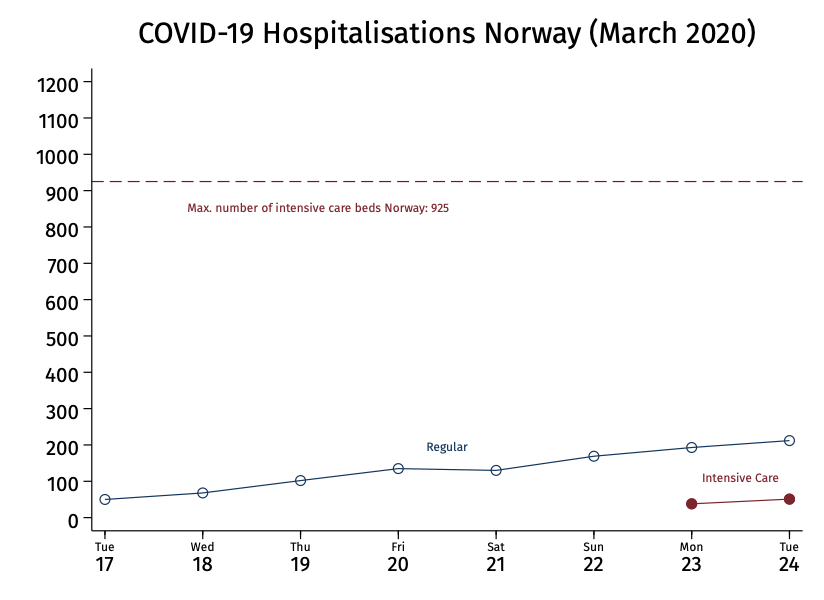

# Value of Statistical life estimates for Norway - COVID-19 

As the dust is settling it is becoming clear that today's Corona crisis is quickly transforming into a major economic crisis. Reports are that unemployment in Norway is now starting to eclipse the levels seen in the big depression in the 1930s, and the Ministry of Finance is reporting that the Corona measures cost 280 billion crowns, 8% of GDP, and are likely to grow.

Norwegian authorities claim that they did not have time to evaluate the economic cost of the lock-down, but they also do not appear to have considered the economic value of the lives saved either.

Putting a price tag on life sounds harsh, but it is the grim reality of public policy and is routinely done when making decisions about road safety, and prevention of injury and disease. Policy making involves the allocation of limited resources and doing this involves trade-offs that may involve human lives that need to be weighted in these decisions. The Norwegian Ministry of Finance provides guidelines for such weights on its website expressed in crowns. In Norway the economic value of a life saved -- called the value of a statistical life -- is about 36 million crowns. The value of a year of life saved is about 575 thousand crowns.

Using these numbers, population statistics and life tables from Statistics Norway, fatality rates from Korea calibrated to match Norwegian/German levels, and assuming relative poor health of Corona victims, I estimate that the value of statistical life (VSL) lost for Norway if 60% gets infected with Corona is 0.9% of GDP. Ten times less than the 280 billion crowns mentioned above. This number is relatively low because Corona hits the old and infirm the hardest and ignoring this would overestimate the value of life lost by a factor of 12. Unadjusted fatality rates would put the number at 3% of GDP, and assuming below average rather than poor health 1.7% of GDP. 

| Age   | Population | Average | \<Average | Poor | Fatality Rate |    Deaths | Average | \<Average |   Poor |
| :---- | ---------: | :-----: | :-------: | :--: | :-----------: | --------: | ------: | --------: | -----: |
| 0-9   |    605,358 |  77.8   |   72.3    | 61.3 |    0.00001    |         2 |     163 |       152 |    129 |
| 10-19 |    643,391 |  68.1   |   62.5    | 51.6 |    0.00002    |         7 |     456 |       419 |    346 |
| 20-29 |    711,752 |  58.1   |   52.4    | 42.4 |    0.00009    |        37 |   2,151 |     1,939 |  1,568 |
| 30-39 |    730,547 |  48.6   |   42.6    | 32.6 |    0.00023    |       101 |   4,922 |     4,316 |  3,302 |
| 40-49 |    723,663 |  38.7   |   32.4    | 23.4 |    0.00043    |       188 |   7,287 |     6,098 |  4,404 |
| 50-59 |    703,830 |  29.6   |   23.4    | 14.9 |    0.00173    |       732 |  21,706 |    17,110 | 10,947 |
| 60-69 |    582,495 |  20.8   |   14.7    | 8.2  |    0.00636    |     2,223 |  46,310 |    32,753 | 18,215 |
| 70-79 |    435,834 |  13.3   |    7.8    | 3.5  |    0.01474    |     3,855 |  51,336 |    29,924 | 13,547 |
| 80+   |    230,710 |   6.4   |    2.5    | 0.8  |    0.02688    |     3,721 |  23,909 |     9,449 |  2,794 |
|       |            |         |           |      |               |           |         |           |        |
| Total |  5,367,580 |   82    |    77     |  66  |    0.00337    |    10,866 | 158,241 |   102,159 | 55,251 |
|       |            |         |           |      |               |           |         |           |        |
|       |            |         |           |      |               | Life Toll |  VSL(Y) |       NOK |   %GDP |
|       |            |         |           |      |   Deaths      |    10,866 |     36M |  391,176M |   11.0 |
|       |            |         |           |      |   Health:     |           |         |           |        |
|       |            |         |           |      |   Average     |   158,241 |  0.575M |   90,989M |    2.6 |
|       |            |         |           |      |   <Average    |   102,159 |  0.575M |   58,741M |    1.7 |
|       |            |         |           |      |   Poor        |    55,251 |  0.575M |   31,769M |    0.9 |

*Notes & Data sources: Life Expectancy: https://www.ssb.no/256921/life-tables. Average=Average, \<Average 25th percentile, Poor: 10th percentile. Population Size: https://www.ssb.no/en/statbank/table/07459/tableViewLayout2/ Fatality Rate: Impact of non-pharmaceutical interventions (NPIs) to reduce COVID-19 mortality and healthcare demand. Imperial College Imperial College COVID-19 Response Team, 16 march 2020. Relatively adjusted to match Norwegian COVID-19 deaths per case of 0.00337 (which is similar to that of Germany). Value of a Statistical Life (VSL), VSL year (VSLY) (in million (M) NOK) adjusted to 2020 NOK using CPI: https://www.regjeringen.no/no/dokumenter/nou-2012-16/id700821/?ch=11*
 
Until now Norway's policy has been to suppress rather than mitigate the virus. While it is crucial to ensure that the health system does not collapse, current numbers show that we are not exploiting hospital capacity. 

Most of the VSL is concentrated in the older age groups as illustrated by the following table:

|       | Average | \<Average | Poor | Labor Force |
| :---: | :-----: | :-------: | :--: | :---------: |
| 10-19 |  \<.01  |   \<.01   | 0.01 |    0.04     |
| 20-29 |  0.01   |   0.02    | 0.03 |    0.20     |
| 30-39 |  0.03   |   0.04    | 0.06 |    0.23     |
| 40-49 |  0.05   |   0.06    | 0.08 |    0.22     |
| 50-59 |  0.14   |   0.17    | 0.20 |    0.20     |
|  60+  |  0.77   |   0.71    | 0.63 |    0.11     |

Between 63% to 77% of the cost is in the 60+ age group which only accounts for 11% of the labor force. While only 9% to 17% of the cost is among the age group up to 40 which account for about 70% of the labor force.

Given the relatively modest cost of higher infection rates and the large economic cost of keeping them low, these numbers suggest that Norway should seriously consider steps toward a more targeted and weaker mitigation strategy. 

At a minimum The Ministry of Finance should start to follow its own cost-benefit recommendations and take the economics of the Corona crisis seriously. The economic stakes are too high to make policy on medical terms alone.
